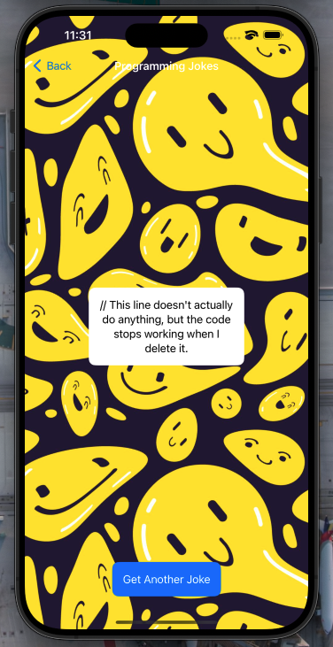

# Jokes App (App 9) 📱

Welcome to the **Jokes App (App 9)** repository! This project was developed as part of my iOS Networking module with CodeWithChris. The app fetches jokes from an API and displays them in a sleek, responsive interface built with SwiftUI.

  
  


## 📄 Overview

**Jokes App** is a simple yet fun iOS application that showcases the following features:

- **API Integration:** Connects to a joke API to fetch and display jokes.
- **SwiftUI:** Utilizes SwiftUI for building a responsive and intuitive user interface.
- **Concurrency:** Implements `async` and `await` for efficient data handling.

## 🚀 Features

- **Dynamic Content:** The app fetches new jokes with each user interaction, ensuring fresh content.
- **Responsive Design:** The UI adapts smoothly across different device sizes.
- **Real-time Updates:** Data fetched from the API is displayed immediately, providing a seamless user experience.

## 📚 Technologies Used

- **Swift**
- **SwiftUI**
- **URLSession** for API requests
- **JSON Parsing** for handling API responses

## 🛠 Setup & Installation

To run this project locally:

1. Clone the repository:
   ```bash
   git clone https://github.com/your_username/jokes-app.git

Open the project in Xcode.
Build and run the app on your desired simulator or device.
🌐 API Details
This app uses the JokeAPI to fetch random jokes. No authentication is required to access the API.

🖼 Screenshots

Screenshot of the main interface displaying a joke.


Screenshot showing the app fetching a new joke.


Screenshot displaying the app's responsive UI on different device sizes.

🤝 Contributing
Contributions are welcome! Feel free to fork this repository, submit issues, or make pull requests. Please ensure your contributions align with the project’s objectives.